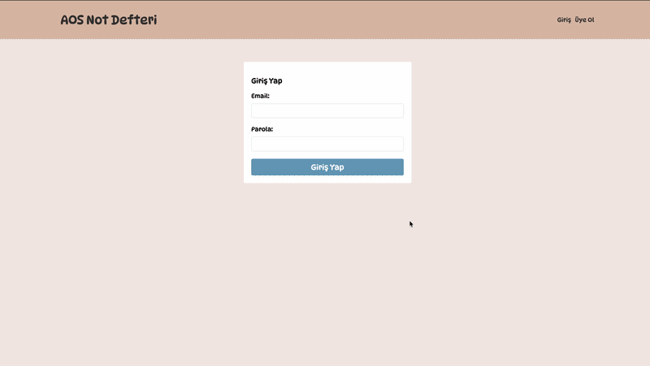

# 📓 AOS Not Defteri

Kişisel not alma ve yönetme uygulaması. React tabanlı frontend ve Node.js/Express tabanlı backend ile geliştirilmiş full-stack bir web uygulamasıdır.

---

## 📸 Ekran Görüntüleri




---

## 🚀 Özellikler

- 🔐 Kullanıcı kayıt ve giriş sistemi (JWT tabanlı kimlik doğrulama)
- 📝 Not oluşturma, düzenleme ve silme
- 🔒 Şifrelenmiş parola saklama (bcrypt)
- 📱 Responsive ve kullanıcı dostu arayüz

---

## 🛠️ Kullanılan Teknolojiler

### Frontend
| Teknoloji | Versiyon |
|-----------|----------|
| React | ^19.2.7 |
| React Router DOM | ^7.18.0 |
| Moment.js | ^2.30.1 |

### Backend
| Teknoloji | Versiyon |
|-----------|----------|
| Node.js / Express | ^5.2.1 |
| MongoDB / Mongoose | ^9.7.1 |
| JSON Web Token | ^9.0.3 |
| bcrypt | ^6.0.0 |
| dotenv | ^17.4.2 |
| validator | ^13.15.35 |

---

## 📁 Proje Yapısı

```
aos-not-defteri/
├── frontend/          # React uygulaması
│   ├── public/
│   └── src/
│       ├── components/
│       ├── pages/
│       └── App.js
└── backend/           # Express API sunucusu
    ├── models/
    ├── routes/
    ├── controllers/
    ├── middleware/
    └── server.js
```

---

## ⚙️ Kurulum

### Gereksinimler
- Node.js (v18+)
- MongoDB

### 1. Repoyu Klonla

```bash
git clone https://github.com/kullanici-adi/aos-not-defteri.git
cd aos-not-defteri
```

### 2. Backend Kurulumu

```bash
cd backend
npm install
```

`.env` dosyası oluştur:

```env
PORT=4000
MONGO_URI=mongodb://localhost:27017/aos-not-defteri
JWT_SECRET=gizli_anahtar_buraya
```

Sunucuyu başlat:

```bash
npm run dev
```

### 3. Frontend Kurulumu

```bash
cd frontend
npm install
npm start
```

Uygulama `http://localhost:3000` adresinde çalışmaya başlayacaktır.

---

## 🔗 API Endpointleri

| Method | Endpoint | Açıklama |
|--------|----------|----------|
| POST | `/api/auth/register` | Kullanıcı kaydı |
| POST | `/api/auth/login` | Kullanıcı girişi |
| GET | `/api/notes` | Tüm notları getir |
| POST | `/api/notes` | Yeni not oluştur |
| PUT | `/api/notes/:id` | Not güncelle |
| DELETE | `/api/notes/:id` | Not sil |

---


## 🤝 Katkıda Bulunma

1. Bu repoyu fork edin
2. Yeni bir branch oluşturun (`git checkout -b feature/yeni-ozellik`)
3. Değişikliklerinizi commit edin (`git commit -m 'Yeni özellik eklendi'`)
4. Branch'i push edin (`git push origin feature/yeni-ozellik`)
5. Pull Request açın

---

## 📄 Lisans

Bu proje MIT lisansı altında lisanslanmıştır.

---

